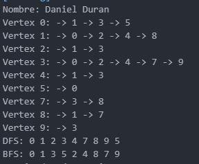

# Proyecto de Grafo en Java

## Nombre: - Daniel Antonio Duran 
## Carrera: Computacion | Fecha: -  10/7/2025

Este proyecto implementa una estructura de datos **Grafo** en Java. El grafo es no dirigido y permite realizar las siguientes operaciones:

- **Agregar nodos**
- **Agregar aristas** (conexiones entre nodos)
- **Imprimir el grafo** (visualización de las conexiones de cada nodo)
- **Búsqueda en profundidad (DFS)**: Recorrido en profundidad desde un nodo inicial.
- **Búsqueda en amplitud (BFS)**: Recorrido en amplitud desde un nodo inicial.
- **Matriz de adyacencia**: Representación del grafo en una matriz.

## Estructura del Proyecto

El proyecto consta de tres clases principales:

- **Node.java**: Define el nodo del grafo.
- **Graph.java**: Implementa la lógica del grafo, incluyendo la adición de nodos y aristas, y los algoritmos de búsqueda.
- **App.java**: Contiene el código de prueba, donde se crea un grafo y se realizan diversas operaciones sobre él.

## Clases

### `Node.java`
Esta clase representa un nodo en el grafo y contiene los siguientes métodos:

- **`int getValor()`**: Retorna el valor del nodo.
- **`Set<Node> getNeighbors()`**: Retorna los vecinos (nodos conectados) de este nodo.
- **`void addNeighbor(Node neighbor)`**: Añade un vecino al nodo.

### `Graph.java`
Esta clase implementa el grafo y sus operaciones. Los métodos principales son:

- **`Node addNode(int value)`**: Agrega un nodo al grafo.
- **`void addEdge(Node src, Node dest)`**: Agrega una arista entre dos nodos.
- **`void addEdgeUni(Node src, Node dest)`**: Agrega una arista unidireccional (solo de src a dest).
- **`void printGraph()`**: Imprime el grafo mostrando las conexiones de cada nodo.
- **`void getDFS(Node startNode)`**: Realiza una búsqueda en profundidad (DFS) comenzando desde un nodo dado.
- **`void getBFS(Node startNode)`**: Realiza una búsqueda en amplitud (BFS) comenzando desde un nodo dado.
- **`int[][] getAdjacencyMatrix()`**: Retorna la matriz de adyacencia del grafo.
- **`void printAdjacencyMatrix()`**: Imprime la matriz de adyacencia.

### `App.java`
Contiene el método principal (**`main`**) que ejecuta el programa de prueba. Aquí se agregan nodos, se conectan con aristas, y se ejecutan los métodos de búsqueda y de visualización.

## Ejemplo de Uso

```java
public class App {
    public static void main(String[] args) throws Exception {
        Graph grafo = new Graph();

        Node nodo0 = grafo.addNode(0);
        Node nodo5 = grafo.addNode(5);
        Node nodo3 = grafo.addNode(3);
        Node nodo1 = grafo.addNode(1);
        Node nodo2 = grafo.addNode(2);
        Node nodo4 = grafo.addNode(4);
        Node nodo9 = grafo.addNode(9);
        Node nodo7 = grafo.addNode(7);
        Node nodo8 = grafo.addNode(8);

        grafo.addEdge(nodo0, nodo5);
        grafo.addEdge(nodo0, nodo3);
        grafo.addEdge(nodo0, nodo1);
        grafo.addEdge(nodo1, nodo2);
        grafo.addEdge(nodo1, nodo4);
        grafo.addEdge(nodo1, nodo8);
        grafo.addEdge(nodo3, nodo2);
        grafo.addEdge(nodo3, nodo4);
        grafo.addEdge(nodo3, nodo7);
        grafo.addEdge(nodo3, nodo9);
        grafo.addEdge(nodo7, nodo8);

        grafo.printGraph();  // Imprime el grafo
    }
}
```
s
# Salida esperada:



```java
Nombre: Daniel Duran
Vertex 0: -> 1 -> 3 -> 5
Vertex 1: -> 0 -> 2 -> 4 -> 8
Vertex 2: -> 1 -> 3
Vertex 3: -> 0 -> 2 -> 4 -> 7 -> 9
Vertex 4: -> 1 -> 3
Vertex 5: -> 0
Vertex 7: -> 3 -> 8
Vertex 8: -> 1 -> 7
Vertex 9: -> 3
```
### Funcionalidades
-   DFS (Búsqueda en profundidad): Realiza un recorrido profundo desde un nodo inicial, visitando todos los nodos conectados de manera recursiva.

-   BFS (Búsqueda en amplitud): Realiza un recorrido por niveles (amplitud) desde un nodo inicial, visitando los nodos en un orden de cercanía.

-   Matriz de Adyacencia: Representa el grafo en una matriz cuadrada donde el valor 1 indica que existe una conexión entre los nodos, y 0 en caso contrario.
